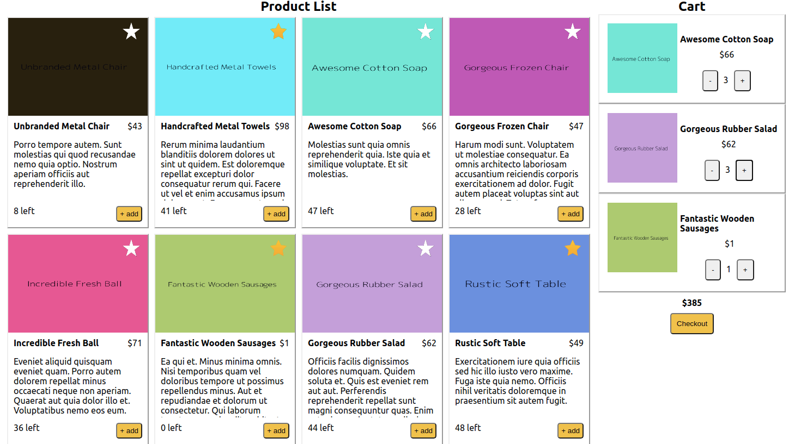

# react app

## Requirements
- node `v12`+
- port `8080` on `localhost` must be free
- API should be running on port `3000`

## Setup
In project root directory run:  
- `npm install`

## Tests
- `npm run test` : watcher on
- `npm run test-ci` : watcher off

## Run
- `npm start`
- navigate to http://localhost:8080/

## Notes
- Remember to run the backend API (json-server) provided
- The app is responsive, the `breakpoint` for mobile views are iphone 6/7/8
- Click in the star button to add or remove from favorite list (saved in backend)
- I tried to test some components, unit and integration, it would have be fine to add some e2e with playwright
- This is a simple solution for the problem, sometimes I copied/pasted (ie: css) to save some time
- If you have any doubt or question contact me!

